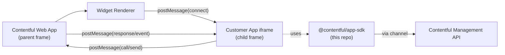

# Architecture — `ui-extensions-sdk`

This repository builds the **App SDK** and publishes it to npm as `@contentful/app-sdk` (preferred) and `contentful-ui-extensions-sdk` (legacy alias). Everything below describes the codebase in this repo and the runtime it ships.

## Overview

The App SDK is the **bridge** between an app running in a sandboxed iframe (the *child frame*, customer code) and the Contentful Web App (the *parent frame*, host). It exposes a typed, Promise-based JavaScript API that wraps PostMessage interactions with the host. Apps call `init()`, receive a location-specific SDK object, and use it to read/write content, open dialogs, navigate, and (in newer surfaces) interact with AI agents.

Inception: 2015-11-02 (`d21d1f9` `Initial commit`). Core transport pattern is unchanged; new locations and APIs are layered on top.

## System Context



The SDK never talks to Contentful APIs directly. CMA calls flow through the channel: `app code → sdk.cma.<method>() → cmaAdapter → channel.call('CMAAdapterCall', opts) → web app → CMA`. This indirection lets the host inject auth, environment, and release context without the app handling tokens.

## Module Map (`lib/`)

| Module | Role | Key surface |
|---|---|---|
| `index.ts` | Public entry: re-exports types and exposes `init` + `locations` | `init`, `locations`, all public types |
| `initialize.ts` | Listens for the host's `connect` message, builds the SDK, and hands it to the user's callback | `createInitializer` |
| `channel.ts` | PostMessage send/receive; correlates request IDs to response promises; dispatches host events to handlers | `Channel`, `connect`, `sendInitMessage` |
| `signal.ts` | Tiny event emitter; `MemoizedSignal` replays the latest value to new subscribers | `Signal`, `MemoizedSignal` |
| `api.ts` | Composes the location-specific SDK by reducing a list of "producer" functions | `createAPI`, `LOCATION_TO_API_PRODUCERS` |
| `locations.ts` | The `locations` runtime enum exported to consumers | `LOCATION_*` keys |
| `entry.ts` | Entry-level API (`getSys`, `publish`, `save`, `onSysChanged`, fields, tasks, metadata) | `createEntry` |
| `field.ts` | Per-content-type field; multi-locale wrapper | `makeField` |
| `field-locale.ts` | Single field+locale: `getValue`, `setValue`, `onValueChanged`, validation/disabled signals | `makeFieldLocale` |
| `editor.ts` | Entry editor settings: locale settings, hidden-field visibility | `createEditor` |
| `space.ts` | Legacy CRUD wrappers (deprecated since v4.0.0) — every method warns and delegates to channel | `createSpace` |
| `dialogs.ts` | System dialogs (alert/confirm/prompt) and entity selectors (entries, assets, experiences, patterns, component definitions) | `createDialogs` |
| `navigator.ts` | Open/navigate to entries, assets, app pages, app config; release-aware | `createNavigator` |
| `app.ts` | App lifecycle hooks for the config screen: `setReady`, `onConfigure` (preInstall), `onConfigurationCompleted` (postInstall) | `createApp` |
| `agent.ts` | AI agent location: context updates, toolbar actions, layout variant control | `createAgent` |
| `asset.ts` | Asset-side methods on the asset sidebar location | `createAsset` |
| `cma.ts` | Wraps `contentful-management` `createClient` with the channel-backed adapter | `createCMAClient` |
| `cmaAdapter.ts` | The channel-backed `Adapter` for `contentful-management` | `createAdapter` |
| `window.ts` | iframe height management: `MutationObserver`-driven auto-resize + manual `updateHeight` | `createWindow` |
| `types/` | Public TypeScript surface — no runtime code | All `*AppSDK` types, `ConnectMessage`, `IdsAPI`, etc. |
| `utils/deferred.ts` | Promise-with-external-resolve helper used by `initialize.ts` | `createDeferred` |

## Data Flow: Initialization Handshake

```
[Host]                                                [App iframe]
  │                                                          │
  │                              ◄─── connect listener ──────│  channel.ts:waitForConnect
  │                                                          │  installs message listener
  │                              ◄── postMessage(init) ──────│  channel.ts:sendInitMessage
  │                                                          │
  │── postMessage("connect", [params, queue]) ─►            │  initialize.ts:connectDeferred resolves
  │                                                          │  api.ts:createAPI builds SDK
  │                                                          │  user's init callback invoked
  │                                                          │
  │── postMessage(<event/method/response>) ────────────────►│  channel.ts:_handleMessage routes
```

The SDK *connects immediately on import*, before `init()` is called, so it doesn't lose host messages that arrive before the app is ready (`initialize.ts:21-32`). User callback fires after the connect handshake completes.

## Data Flow: A Field Read

```
app code             field-locale.ts        channel.ts          host
   │ getValue() ────►│                         │                  │
   │                 │ returns memoized value  │                  │
   │◄────────────────│                         │                  │
                                              ...
host emits valueChanged event
   │                 │ ◄── addHandler ─────────│                  │
   │ onValueChanged ─│                         │                  │
   │   (handler)     │                         │ ◄── postMessage ─│
   │                 │  signal.dispatch        │                  │
   │◄── handler ─────│                         │                  │
```

Reads of "current value" are local (memoized in `MemoizedSignal`); writes (`setValue`) and most other operations round-trip through the channel.

## Build Pipeline

```
lib/**/*.ts
   │
   ├─► tsc --noEmit                       (npm run check-types — gate)
   │
   └─► rollup (rollup.config.js)
         ├─► dist/cf-extension-api.js          UMD, target=ES5, terser-minified
         ├─► dist/cf-extension-api.bundled.js  UMD with deps inlined for CDN consumption
         ├─► dist/index.d.ts                   tsc-emitted ambient types
         └─► dist/cf-extension.css             (legacy stylesheet, kept for back-compat)
```

- **Target ES5** for broadest browser compatibility (`tsconfig.json#target`); customers loading via `<script>` from jsdelivr/unpkg may serve to old browsers.
- **UMD** so the bundle works as a CommonJS export in Node-y bundlers, an AMD module, or a browser global.
- **Two outputs** — `cf-extension-api.js` keeps `contentful-management` external (the dependent expects to provide it), `cf-extension-api.bundled.js` inlines everything for CDN script-tag use.
- **`globalThis.contentfulApp` and `globalThis.contentfulExtension`** are both set as browser globals (`rollup.config.js:25`) so old `<script>` integrations continue to work.

## Dual-Package Publishing

Same `dist/` is published under two npm package names, in this order, by `scripts/publish.js`:

1. `contentful-ui-extensions-sdk`
2. `@contentful/app-sdk`

`scripts/shared.js` rewrites `package.json#name` between publishes and runs `npm install` to refresh metadata before each `npm publish`. `restorePackageJson` resets the file at the end. Versions are kept in lock-step — both packages always release the same version.

Driven by `semantic-release` via the `@semantic-release/exec` plugin (`package.json#release.plugins`), which calls `verify.js` for `verifyConditions` and `publish-all` for `publishCmd`. Trusted publishing via HashiCorp Vault provides short-lived npm tokens (`.github/workflows/release.yaml`).

## Branches & Release Channels

| Branch | npm dist-tag | Version pattern |
|---|---|---|
| `main` | `latest` | `X.Y.Z` |
| `canary` | `canary` | `X.Y.Z-alpha.N` |

Per `package.json#release.branches`. Canary is "reset to main, branch, PR into canary, merge."

## CI / Release

```
PR or push to main/canary  ─►  .github/workflows/ci.yaml
                                  matrix: Node 22, Node 24
                                  install → lint → test → build → size → upload reports → cache dist (main only)

push to main (CI green) ──────►  .github/workflows/release.yaml
                                  Vault → checkout → semantic-release → publish to npmjs.org × 2

dependabot PR ────────────────►  .github/workflows/dependabot-approve-and-request-merge.yml
                                  contentful/github-auto-merge@v1
```

- **Branch protection on:** 1 required approving review, code-owner review required, stale reviews dismissed on push, strict status checks, no force-push, no branch deletion based on the repo's GitHub branch-protection settings.
- **Semantic PR titles required** — `.github/semantic.yml` enforces title-only validation (PRs are squash-merged).
- **Release runs after CI succeeds** via `workflow_run` trigger; the manual `workflow_dispatch` path also accepts `canary` for ad-hoc alpha cuts.

## Key Dependencies

| Package | Role | Type |
|---|---|---|
| `contentful-management` (^12.3.1) | CMA types + `createClient` adapter point | **Runtime — only one** |
| `rollup` (2.80) + `@rollup/plugin-commonjs` + `@rollup/plugin-node-resolve` + `rollup-plugin-typescript2` + `rollup-plugin-terser` | Bundler chain | Build |
| `typescript` (5.9) | Type-check + `.d.ts` emit | Build |
| `mocha` + `ts-mocha` + `chai` + `sinon` + `sinon-chai` + `chai-as-promised` + `jsdom` | Test stack | Test |
| `eslint` (8.57) + `eslint-config-standard` + `eslint-config-prettier` + `@typescript-eslint/*` | Linting | Tooling |
| `husky` + `lint-staged` | Pre-commit `prettier --write` + `eslint --fix` on staged TS/MD files | Tooling |
| `semantic-release` (^25) + `@semantic-release/changelog` + `@semantic-release/exec` + `@semantic-release/git` | Release automation | Release |

## Configuration & Conventions

- **`.npmrc`**: `ignore-scripts=true` (security; install-time scripts in transitive deps cannot run); `@contentful` registry is npmjs.org (not GitHub Packages).
- **`.nvmrc`**: `v24.11.0` is the recommended local Node version. CI runs Node 22 and 24 in matrix.
- **`tsconfig.json`**: strict mode on; ES5 target; ESNext module; declaration emit on; `noEmit` is set in `tsconfig.test.json`.
- **`eslint.config`** extends `standard` + `prettier/recommended` + `@typescript-eslint/eslint-recommended`; `no-var` and `prefer-const` are errors; the deprecated `babel-eslint` is still pulled in but not configured as a parser.
- **`prettier`**: 100-col, single quotes, no semis, JSX bracket same line.

## Operational Knowledge

This repo publishes a library — there are no SLOs, runbooks, or alert routes bound to it directly. Library bugs surface in consuming services, so escalation flows through *those* runbooks. Internal escalation paths (on-call rotations, alert routing) are documented separately in internal Contentful resources.

- **CI/release breakage**: routed via the alert channel configured in `catalog-info.yaml#contentful.com/ci-alert-slack`.
- **Security alerts**: monitor Dependabot continuously and treat security-relevant updates as priority — the SDK ships to many installations.

### Broken-release recovery (forward-fix, not rollback)

If a published SDK version is broken (e.g., npm publish corruption, a regression in app code that customers fetch via `<script src="https://cdn.jsdelivr.net/npm/@contentful/app-sdk@4">`):

1. **`npm unpublish` is not a valid recovery path.** Per [npm's unpublish policy](https://docs.npmjs.com/policies/unpublish), versions older than 72 hours cannot be unpublished, and `npm deprecate` does not stop CDN fetches — customers still receive the broken version.
2. **Ship a forward-fix version.** Cut a new patch release. All CDN consumers immediately move forward; bundled consumers move on their next deploy.
3. **Trigger:** `workflow_dispatch` of `release.yaml` (manual run from the Actions UI) is the documented escape hatch. Use the `main` branch for a `latest`-tag fix, the `canary` branch for an alpha-tag fix.
4. **Detection:** there is no proactive monitoring of CDN bundle integrity. Breakage is typically reported by customers.

### CDN dependency surface

The SDK has hard dependencies on `npmjs.org` and `cdn.jsdelivr.net` / `unpkg.com` for CDN consumers. Both can fail independently of Contentful infrastructure. Mitigations:

- Subscribe to npm status (`https://status.npmjs.org/`)
- Periodically check unpkg/jsdelivr endpoints

**Behavior during a CDN outage:**
- **Bundled installs** (customer ran `npm install @contentful/app-sdk` and bundled the SDK into their app): unaffected — the SDK is already in their build artifact.
- **Script-tag installs** (`<script src="https://cdn.jsdelivr.net/npm/@contentful/app-sdk@4">`): hard-fail on app load. The customer's app iframe will not initialize until the CDN is reachable again. There is no SDK-side retry or fallback CDN.
- **CMA outage** (Contentful Management API unavailable): SDK methods that call through `sdk.cma.*` reject with the underlying CMA error. Cached values (`field.getValue()`, `entry.getSys()`) continue to return their last-known values from `MemoizedSignal` state.

### Production breakage triage

This repo has no SDK-bound dashboards (no Datadog, Grafana, or other monitor specific to this repo — `kind: library` entities are not bound to runtime monitoring). Diagnostic signal lives in:

1. **GitHub Actions** for CI/release breakage: `https://github.com/contentful/ui-extensions-sdk/actions`
2. **npm package page** for publish state: `https://www.npmjs.com/package/@contentful/app-sdk`
3. **Consuming-service dashboards** for downstream effect — owned by the respective consuming-service teams.

| Symptom | First place to look |
|---|---|
| Suspected bad SDK version on npm | Run `npm view @contentful/app-sdk versions --json` and compare against `git log --oneline` of release commits; if a bad version shipped, follow "Broken-release recovery" above |
| CI/release pipeline failure | `release.yaml` and `ci.yaml` runs in GitHub Actions; alert channel configured in `catalog-info.yaml#contentful.com/ci-alert-slack` |
| Customer reports app rendering empty / not loading | Escalate via the consuming service's standard support path — this repo is not the right place to triage it |
| Customer reports rate-limit errors | Falls back to the consuming Web App's monitoring; SDK has no rate-limit telemetry of its own |

The "primary alarm" question doesn't apply to this repo — there isn't one. When something looks wrong, *escalate to the consuming service's on-call*, not respond directly here.

### Cross-repo testing for non-trivial SDK changes

The SDK is consumed by other internal Contentful packages and by the host web app itself. For wide-blast-radius changes, the observed practice is:

1. Branch in `ui-extensions-sdk`; run `lint`, `check-types`, `build`, `test` locally.
2. If a local-package link is enough → link the branch into the relevant downstream package and verify there; otherwise push to `canary` and cut a real `X.Y.Z-alpha.N` release.
3. Bump the linked or canary version in each downstream package and run its CI.
4. For host-flagged surfaces (e.g., the agent location), coordinate with the host team to verify the relevant feature flags are configured in the test environment before running through to the web app.

This is intentionally captured as *observed practice* rather than a canonical playbook — the cross-repo flow evolves over time, and freezing it at CONTRIBUTING-level prescription invites drift.

